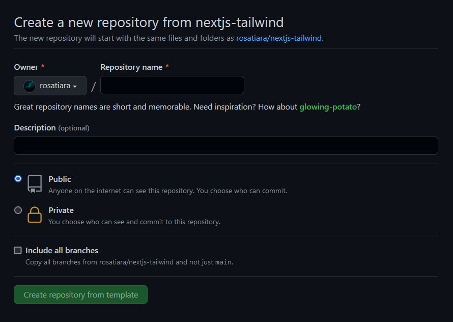

<div align="center">
  <h1>Next.js + TailwindCSS Project Starter</h1>
</div>

## Features
- Next.js 12
- Tailwind CSS 3
- Absolute Import & Path Alias
- ESLint
- Prettier

## Getting Started
### 1. Clone this template by _**using one**_ of these three ways:
#### A. Using this template directly
1. Click the green "Use this template" button on this template directory.

2. Configure your repository & jump to [step 2](https://github.com/rosatiara/nextjs-tailwind#2-install-dependencies)

#### B. Using `create-next-app`
Type or copy this command on your terminal:
```bash
npx create-next-app -e https://github.com/rosatiara/nextjs-tailwind your_project_name_here
```
#### C. Deploy to Vercel
   [](https://vercel.com/new/git/external?repository-url=https%3A%2F%2Fgithub.com%2Frosatiara%2Fnextjs-tailwind)
### 2. Install dependencies
On your terminal, enter:
`npm install` 
**or** 
`yarn install`
### 3. Run the development server
Start the server using this command:
`npm run dev`
**or**
`yarn dev`
